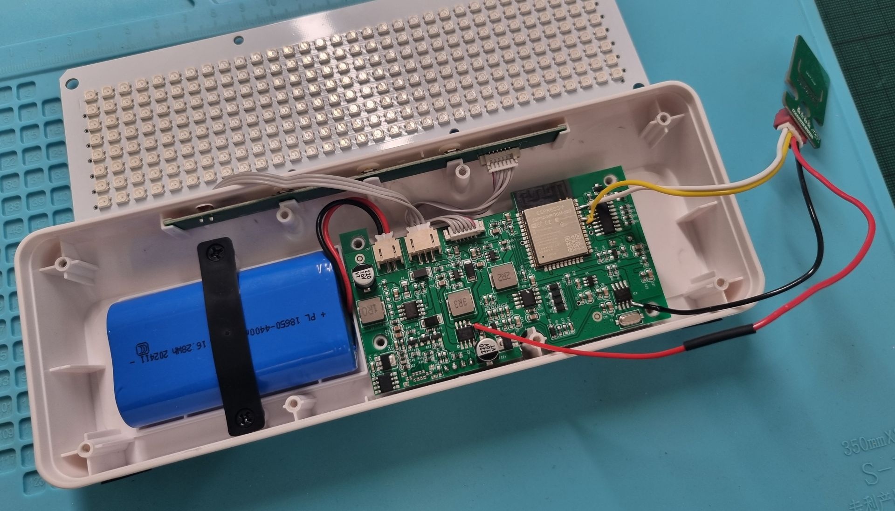
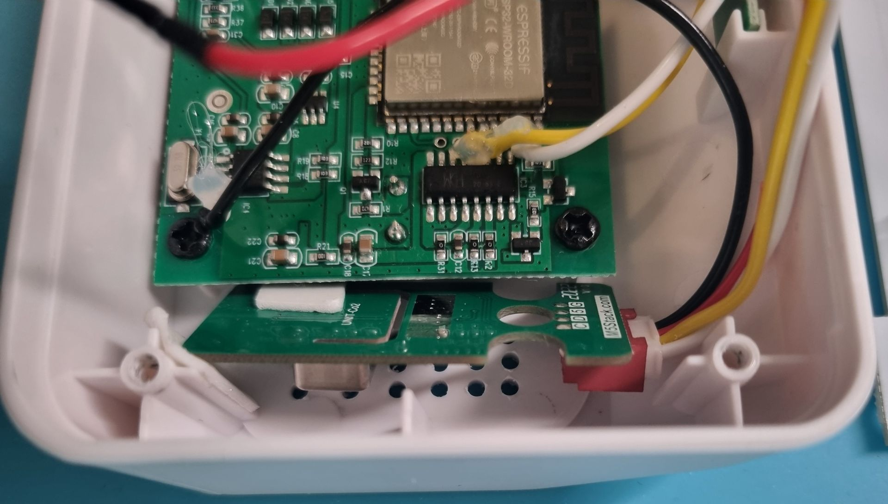

# OFFTRIX 3

OFFTRIX 3 is a customized version of the awesome [AWTRIX 3](https://github.com/Blueforcer/awtrix3) firmware that runs on the [Ulanzi TC001](https://www.ulanzi.com/products/ulanzi-pixel-smart-clock-2882) pixel clock.

## Enhancements

- Offline capabilities
- Support for the [Sensirion SCD4x NDIR CO₂ sensor](https://sensirion.com/products/catalog/SCD40) connected over I²C

This makes a TC001 with OFFTRIX the perfect device for measuring the CO₂ concentration in places where you're not in control of the wireless network configuration or where Wifi isn't available to begin with.

## Screenshots

## Documentation

### Installation

There currently aren't any binaries available but I might provide these if there's interest.
To build from source, clone the project and use the PlatformIO extension for Visual Studio Code to compile and upload the firmware.

### Usage

Most everything should work just like on the original AWTRIX 3 whose documentation you can find [here](https://blueforcer.github.io/awtrix3/#/README).
Notable differences are:

- In AP mode, a short press of the left button exits AP mode and enters offline mode.
- Holding the right button while turning on the pixel clock enters offline mode immediately.
- A three-second long press of the right button reboots the device.

### Hardware modification: Adding a CO₂ sensor

I used a [M5Stack CO2 Unit](https://shop.m5stack.com/products/co2-unit-with-temperature-and-humidity-sensor-scd40) and removed the case, so that the board fits nicely into the case.
There exist multiple hardware revisions of the TC001 but this worked for the one I have.

The CO₂ unit's pinout is as follows:

- Black: GND
- Red: power supply (nominally 5V but it works fine at much lower voltages)
- Yellow: SDA
- White: SCL

Steps:

1. Disassemble the TC001. I found the following two videos helpful:
    - [How to Remove Battery from Ulanzi TC001 Clock](https://www.youtube.com/watch?v=HIQl6D0DVNE)
    - [Ulanzi TC001 - Akku aus der Pixeluhr entfernen](https://www.youtube.com/watch?v=-Dn3A5V8ZPo) (also see the comments)
1. The 4407A MOSFET provides the input for the ESP32's LDO regulator. We can hijack it as the input of the CO₂ sensor's supply line (red wire). In my tests, the voltage was sufficient to power the sensor and the ESP32, simultaneously.
1. Connect the sensor's SCL (white wire) to GPIO22 of the ESP32 (right row, third pin from the top).
1. Connect the sensor's SDA (yellow wire) to GPIO21 of the ESP32 (right row, sixth pin from the top).
1. Connect the sensor's ground (black wire) to any ground pin on the PCB, e.g. the right-most pin in the lower row of the DS1307Z.
1. You may want to use some hot glue to ensure the soldered wires don't get loose and move around.
1. Carefully drill a series of holes near where you're planning to place the sensor. Air flow is important but the CO₂ concentration inside the case tracks the outside concentration pretty well with just a couple of small holes. Alternatively, you could have the sensor stick out the side/back for even better results.
1. Stick the sensor board in place with some double-sided tape or hot glue.
1. Test if your pixel clock still works, flash the OFFTRIX firmware, re-test, and close up your TC001 if everything works fine.
